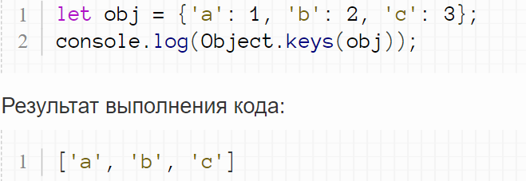
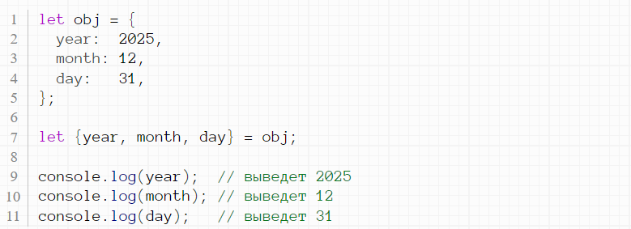

# Что такое объект?
## Объект — это набор свойств, и каждое свойство состоит из имени и значения, ассоциированного с этим именем. Значением свойства может быть функция, которую можно назвать методом объекта.

# Методы объекта
# Метод Object.keys()
## Метод Object.keys возвращает массив из свойств объекта в том же порядке, как и при перечислении через цикл.
# Пример 1

# Метод Object.values
## Метод Object.values возвращает массив из значений объекта в том же порядке, как и при перечислении через цикл.
# Пример 1

# Метод entries()
## Object.entries() возвращает массив, элементами которого являются массивы, соответствующие перечисляемому свойству пары [key, value], найденной прямо в object. Порядок свойств тот же, что и при прохождении циклом по свойствам объекта вручную.

# Деструктуризация объектов в JavaScript
## Можно также делать и деструктуризацию объектов.

